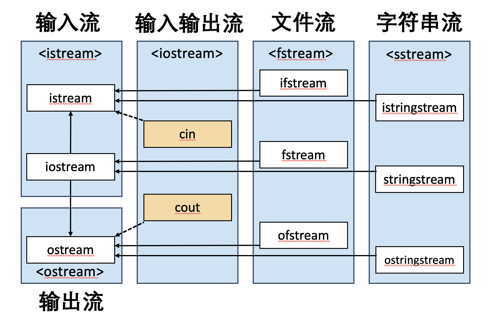

# **iostream 输入输出流**
```C++
ostream& operator<<(ostream& out, const Test& src)
{
	out << src.id << endl;
	return out;
} 
```


ostream 은 输出流的基类
cout是STL中内建的一个ostream对象

## **实现自己的ostream**
```C++
class ostream
{
	public : 
		ostream& operator<<(char c)
		{
			printf("%c",c);
			return *this;
		}
		ostream& operator<<(cost cahr* str)
		{
			printf("%s", str);
			return *this;
		}
}cout;

int main(){
	cout<<"hello<< ' ' <<"world;
	return 0;
}

//先执行cout << "hello" 调用第二个函数 返回c1（cout的引用）
//再执行c1 << ' ' 调用第一个函数 返回c2 (cout的引用）
//最后执行c2 << "world" 调用第二个函数

```
## **格式化输出**
如何格式化输出 – #include <iomanip>
```C++
cout << fixed << 2018.0 << " " << 0.0001 << endl;
				//浮点数 -> 2018.000000 0.000100
cout << scientific << 2018.0 << " " << 0.0001 << endl;
				//科学计数法 -> 2.018000e+03 1.000000e-04
cout << defaultfloat;  //还原默认输出格式
cout << setprecision(2) << 3.1415926 << endl;
				//输出精度设置为2 -> 3.2
cout << oct << 12 << " " << hex << 12 << endl; 
				//八进制输出 -> 14  十六进制输出 -> c
cout << dec;	//还原十进制
cout << setw(3) << setfill('*') << 5 << endl;
				//设置对齐长度为3，对齐字符为* -> **5
```

### ** 如何实现？**

C++标准中未定义，不同编译器有自己的实现方式

一种实现方式的示例
```C++
class setprecision
{
private:
	int precision;
public:
	setprecision(int p) : precision(p) {}
	friend class ostream;
};
// setprecision(2) 是一个类的对象
```

### **流操纵算子(stream manipulator)**

```C++
class ostream
{
private:
	int precision; //记录流的状态
public:
	ostream& operator<<
			(const setprecision &m) {
		precision = m.precision;
		return *this;
	}
} cout;

cout<< setprecision(2);
// setprecision(2) 是一个类的对象

```

### **流操纵算子：endl**

#### **C++标准中endl的声明**
```C++
ostream& endl(ostream& os);
```

#### **endl是一个函数**
等同于输出'\n'，再清空缓冲区 os.flush()
```C++
ostream& endl(ostream& os) {
	os.put('\n');
	os.flush();
	return os;
}
```
可以调用 endl(cout);
#### **缓冲区**
目的是减少外部读写次数.

写文件时，只有清空缓冲区或关闭文件才能保证内容正确写入

一种实现方式的示例
```C++
ostream& operator<<
		(ostream& (*fn)(ostream&)) {
		//流运算符重载，函数指针作为参数
	return (*fn)(*this);
}
```

## **不能复制的cout**
注意重载流运算符的方式
```C++
ostream& operator<<(const char &c)
friend ostream& operator<<(ostream& os, MyClass obj)
```

ostream的复制构造函数

```C++
ostream(const ostream&) = delete;
ostream(ostream&& x);
```
禁止复制、只允许移动

仅使用cout一个全局对象

为什么只能使用一个对象？
1. 减少复制开销
2. 一个对象对应一个标准输出，符合OOP思想
3. 多个对象之间无法同步输出状态
