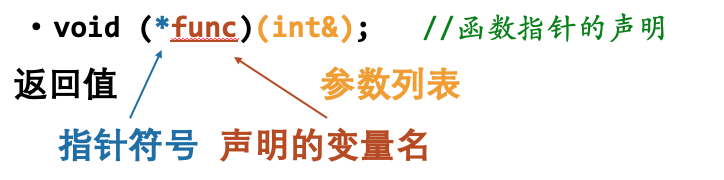

## 函数指针 
### 定义

```C++
if (flag == 1)
	func = increase;
else
	func = decrease;
for (int &x : arr) { func(x);}
```
函数的类型比较难写，使用auto可以自动推断
```C++
//使用auto时必须要初始化
auto func = flag==1?increase:decrease;
for (int &x : arr) { func(x);}
```
## **函数对象**
### 例子 ： sort함수의 compare인자
greater<int>()
greater : 模板类
greater<int> : 用int实例化的类
greater<int>() : 该类的一个对象

마치 함수처럼 작동함
```C++
#include <functional>
#include <iostream>
using namespace std;
int main() {
auto func = greater<int>();
cout << func(2, 1) << endl;	//True
cout << func(1, 1) << endl;	//False
cout << func(1, 2) << endl;	//False
return 0;
}
```

## 函数对象的要求
1. 需要重载operator()运算符
2. 并且该函数需要是public访问权限


### 实现自己的sort
```C++
#include <algorithm>
#include <functional>
using namespace std;

bool comp(int a, int b)
{
	return a > b;
}
template<class Iterator, class Compare>
void mysort(Iterator first, Iterator last, Compare comp)
//mysort的时间复杂度为O(n^2)，std::sort的时间复杂度为O(nlogn)
{
	for (auto i = first; i != last; i++)
		for (auto j = i; j != last; j++)
			if (!comp(*i, *j)) swap(*i, *j);
}
int main()
{
	int arr[5] = { 5, 2, 3, 1, 7 };
	mysort(arr, arr + 5, comp);
	mysort(arr, arr + 5, greater<int>()); 
    //既可接受函数指针，又可接受函数对象
	return 0;
}
```
## 自定义类型的排序
方法1 ： 重载小于运算符
```C++
#include <algorithm>
#include <vector>
using namespace std;
class People
{
public:
	int age, weight;
	bool operator<(const People &b) const
	{
		return age < b.age;
	}
};
int main() {
	vector<People> vec = {{18, 50}, {16, 40}};
	sort(vec.begin(), vec.end());
	return 0;
}
```
方法2：定义比较函数
```C++
#include <algorithm>
#include <vector>
using namespace std;

class People
{  public: int age, weight;  };

bool compByAge(const People &a, const People &b)
	{	return a.age < b.age; }

int main() {
vector<People> vec = {{18, 50}, {16, 40}};
sort(vec.begin(), vec.end(), compByAge);
return 0;
}
```
方法3 ： 定义比较函数对象
```C++
#include <algorithm>
#include <vector>
using namespace std;
class People
{  public:	int age, weight;  };

class AgeComp {
public:
	bool operator()(const People &a, const People &b) const 
		{ 	return a.age < b.age; 	}
};

int main() {
	vector<People> vec = {{18, 50}, {16, 40}};
	sort(vec.begin(), vec.end(), AgeComp());
	return 0;
}
```
