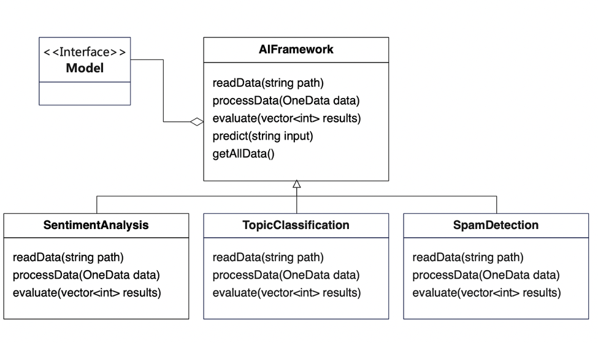

# **设计模式 ： 行为模型**

## **ex) AI模型预测框架**


给定一批数据与AI模型，要求给出模型预测结果
AI模型预测流程通常由数据读入、数据处理、模型预测、结果评测几部分组成

```C++
class AIFramework {
public:
	void readData(string path);
	string processData(OneData data);
	float evaluate(vector<int> results);
	int predict(string input);
	OneData* getAllData();
	AIFramework(Model *model);
	virtual ~AIFramework();
protected: ////用以存储数据和模型的成员变量
	OneData allData[DATA_NUM];
	Model* myModel;
};
//组合一个模型接口来进行结果预测
int AIFramework::predict(string input) {	
	return myModel->predict(input);
}

struct OneData {
	string text;
	int label;
}; 

//主程序
int main(int argc, char *argv[]) {
	Model model;

	AIFramework ai(&model);
	//数据读入
	ai.readData("input.txt");

	vector<int> all_results;
	for (int i = 0; i != DATA_NUM; i++) {
		//数据处理
		string inp = ai.processData(ai.getAllData()[i]);
		//结果预测
		int result = ai.predict(inp);
		all_results.push_back(result);
	}
	//结果评估
	ai.evaluate(all_results);
	return 0; 	
}

//规定所有的任务类型
enum AIFrameworkType 
		{Sentiment, Topic, Spam};
AIFrameworkType type = Sentiment;

…
void AIFramework::readData(string path){

	switch (type) {//读取数据的实现
		//情感分析的数据读取
	case Sentiment:
			allData = …;
	//主题分类的数据读取
	case Topic:
		allData = …;
	//垃圾邮件分类的数据读取
	case Spam:
		allData = …;
	}
}

string AIFramework::processData(OneData data){  //处理数据的实现
	switch (type) {
		case Sentiment:
			…
		case Topic:
			…
		case Spam:
			…
	}
}
float AIFramework::evaluate(vector<int> results){  //结果评测的实现
	switch (type) {
		case Sentiment:
			…
		case Topic:
			…
		case Spam:
			…
	}
}
```

#### **简单枚举存在的问题？当新增一个系统进入后，我们需要对每一个方法进行相应修改，修改的工作量很大。**

## **Template Method**


抽象类（父类）定义算法的骨架.

算法的细节由实现类（子类）负责实现.

在使用时，调用抽象类的算法骨架方法，再由这个方法来根据需要调用具体类的实现细节.

当拓展一个新的实现类时，重新继承与实现即可，无需对已有的实现类进行修改.


ex)


```C++
class AIFramework {
public:
	virtual void readData(string path) = 0;
	virtual string processData(OneData data) = 0;
	virtual float evaluate(vector<int> results) = 0;
	int predict(string input);
	OneData* getAllData();
	AIFramework(Model *model);
	virtual ~AIFramework();
protected: ////用以存储数据和模型的成员变量
	OneData allData[DATA_NUM];
	Model* myModel;
};
//组合一个模型接口来进行结果预测
int AIFramework::predict(string input) {	
	return myModel->predict(input);
}

//通过具体实现抽象的模板来完成情感分析的实现

class SentimentAnalysis:public AIFramework {
public:
	void readData(string path);
	string processData(OneData data);
	float evaluate(vector<int> results);
};

//情感分析的readData(string path)的具体实现
void SentimentAnalysis::readData(string path);{
	…
}

//情感分析的processData(OneData data)的具体实现
string SentimentAnalysis::processData(OneData data) {
	…
}

float SentimentAnalysis::evaluate(vector<int> results){
	...
}

int main(int argc, char *argv[]) {
	Model model;
	AIFramework* ai = new SentimentAnalysis(&model);

	ai->readData("input.txt"); 	//数据读入

	vector<int> all_results;
	for (int i = 0; i != DATA_NUM; i++){
		string inp = ai->processData(ai->getAllData()[i]);//数据处理
		int result = ai->predict(inp); //结果预测
		all_results.push_back(result);
	}
	ai->evaluate(all_results); //结果评估

	delete ai; //释放
	return 0;
}

```

## **Strategy 策略模式**


EX)


ReadStrategy例子
```C++
//读取策略基类
class ReadStrategy {
	public:
	virtual vector<OneData> readData(string path) = 0;
};
//读取算法一具体实现
class ReadStrategyTxt : public ReadStrategy {	
	public:
	vector<OneData> readData(string path) { //读取txt文本数据
		…
		return data;
	}
};
//读取算法二具体实现
class ReadStrategyCsv : public ReadStrategy {	
public:
	vector<OneData> readData(string path) { //读取csv表格数据
		…
		return data;
	}
};
```
ProcessStrategy例子
```C++
//数据处理策略基类
class ProcessStrategy {
	public:
	virtual string processData(OneData data) = 0;
};
//数据处理算法一具体实现
class ProcessStrategyTokenize : public ProcessStrategy {	
	public:
	string processData(OneData data) { //进行数据处理：分词
		…
		return text;
}
};
//数据处理算法二具体实现
class ProcessStrategyStopWord : public ProcessStrategy {	
	public:
	string processData(OneData data) {//进行数据处理：去除停用词
		…
		return text;
}
};
```
AIFramework实现
```C++
class AIFramework {
public:
	//AIFramework就是各个策略类的组合
	AIFramework(ReadStrategy* rs,ProcessStrategy* ps,EvaluateStrategy* es,Model* model);
		void readData(string path);
		string processData(OneData data);
		float evaluate(vector<int> results);
		int predict(string input);
protected:
	//用来完成不同功能的策略类
	ReadStrategy* readStrategy;
	ProcessStrategy* processStrategy;
	EvaluateStrategy* evaluateStrategy;
	//用以存储数据和模型的成员变量
	OneData allData[DATA_NUM];
	Model* myModel;
};

//构造函数初始化所有的策略和参数
AIFramework::AIFramework(ReadStrategy* rs, ProcessStrategy* ps, 	EvaluateStrategy* es, Model* model) :
	readStrategy(rs),
		processStrategy(ps),
		evaluateStrategy(es),
		myModel(model) {}

//组合一个模型接口来进行结果预测
int AIFramework::predict(string input) { 
	return myModel->predict(input);
}

```

链接接口部分
```C++
//统一的接口来读取数据
void AIFramework::readData(string path){
	allData = readStrategy->readData(path);
}
//统一的接口来处理数据
string AIFramework::processData(OneData data){
	return processStrategy->processData(data);
}
//统一的接口来评测结果
float AIFramework::evaluate(vector<int> results){
	return evaluateStrategy->evaluate(results, allData);
} 
```

main函数
```C++
int main(int argc, char *argv[]){
	//为每个策略的选择具体的实现算法，并创建预测框架类
	ReadStrategyTxt readStrategy;
	ProcessStrategyTokenize processStrategy;
	EvaluateStrategyAcc evaluateStrategy;
	Model model;
	//具体构建过程是将每个策略的具体算法类传入构造函数
	AIFramework* ai = new AIFramework(&readStrategy, 							&processStrategy, 
			&evaluateStrategy,
							&model);
	ai->readData("input.txt"); 	//统一的接口读入数据
	vector<int> all_results;
	for (for i = 0; i != DATA_NUM; i++){
		string inp = ai->processData(ai->getAllData()[i]); //统一的接口处理数据
		int result = ai->predict(inp); //统一的接口预测结果
		all_results.push_back(result);
	}
	ai->evaluate(all_results); //统一的接口评估结果
	…
}

```

### 模板方法 VS 策略模式


## **Iterator 迭代器模式**
出发点 ： 如何实现与底层数据结构无关的统一算法接口？


把数据“访问”设计为一个统一接口，形成迭代器

这个迭代器可以套接在任意的数据结构上

迭代器基类
```C++
//迭代器基类
class Iterator {
public:
	virtual ~Iterator() { }
	virtual Iterator& operator++() = 0;
	virtual OneData& operator++(int) = 0;
	virtual OneData& operator*() = 0;
	virtual OneData* operator->() = 0;
	virtual bool operator!=(const Iterator &other) const = 0;
	bool operator==(const Iterator &other) const {
		return !(*this != other);
	}
};

vector<int> analyze(Iterator* begin, Iterator* end, AIFramework* ai) {
	vector<int> all_results;

	for (Iterator* p = begin; *p != *end; (*p)++) {
		string inp = ai->processData(**p);
		int result = ai->predict(inp);
		all_results.push_back(result);
	}

	return all_results;
}
```
Collection基类实现
```C++
class Collection {
public:
	virtual ~Collection() { }
	virtual Iterator* begin() const = 0;
	virtual Iterator* end() const = 0;
	virtual int size() = 0;
};

class ArrayCollection : public Collection { //底层为数组的存储结构类
	friend class ArrayIterator; //friend可以使得配套的迭代器类可以访问数据
	OneData* _data; //若需要实现float数组迭代器，可将OneData改为float
	int _size;
public:
	ArrayCollection() : _size(10){_data = new OneData[_size]; }
	ArrayCollection(int size, OneData * data) : _size(size) {
		_data = new OneData[_size]; 		//开辟数组空间用以存储数据
		for (int i = 0; i < size; i++) 
			*(_data+i) = *(data+i);  
	}
	~ArrayCollection() { delete[] _data; }
	int size() { return _size; }
	Iterator* begin() const;
	Iterator* end() const;
};
Iterator* ArrayCollection::begin() const {	//头迭代器，并放入相应数据
	return new ArrayIterator(_data, 0);  //注意该迭代器应该由外部销毁
}
Iterator* ArrayCollection::end() const { 		//尾迭代器，并放入相应数据
	return new ArrayIterator(_data, _size); 
}

```

基于数组的Iterator实现
```C++
//继承自迭代器基类并配套ArrayCollection使用的迭代器
class ArrayIterator : public Iterator {
	OneData *_data;	//ArrayCollection的数据
	int _index;		//数据访问到的下标
public:
	ArrayIterator(OneData* data, int index) :
		_data(data), _index(index) { }
	ArrayIterator(const ArrayIterator& other) : 
		_data(other._data), _index(other._index) { }
	~ArrayIterator() { }
	Iterator& operator++();
	OneData& operator++(int);
	OneData& operator*();
	OneData * operator->();
	bool operator!=(const Iterator &other) const;
}; 

//迭代器各种内容的实现
Iterator& ArrayIterator::operator++() { //前缀
	_index++; return *this; 
}
//因为是数组，所以直接将空间指针位置+1即可，可以思考下这里为什么返回float&，而不是Iterator
OneData& ArrayIterator::operator++(int) { //后缀
	_index++; 
	return _data[_index - 1]; 
}
//对data的内存位置取值
OneData& ArrayIterator::operator*() {
	return *(_data + _index); 
}
OneData* ArrayIterator::operator->() {
	return (_data + _index);
}
//判断是不是指向内存的同一位置
bool ArrayIterator::operator!=(const Iterator &other) const {
	return (_data != ((ArrayIterator*)(&other))->_data ||
			_index != ((ArrayIterator*)(&other))->_index); 
}

vector<int> analyze(Iterator* begin, Iterator* end, AIFramework* ai) {
	vector<int> all_results;

	for (Iterator* p = begin; *p != *end; (*p)++) {
		string inp = ai->processData(**p);
		int result = ai->predict(inp);
		all_results.push_back(result);
	}

	return all_results;
}
```

### **前缀和后缀的返回类型为什么不一样？**


### **另一种常见的迭代器实现**
```C++
template<class Iterator>
vector<int> analyze(Iterator begin, Iterator end, AIFramework* ai) {
	vector<int> all_results;

	for (Iterator p = begin; p != end; p++) {
		string inp = ai->processData(*p);
		int result = ai->predict(inp);
		all_results.push_back(result);
	}
	return all_results
}

int main()
{
	…
	analyze(ai->getAllData().begin(), ai->getAllData().end(), ai);
	…
	return 0;
}

class AIFramework{
	…
	vector<OneData> allData;
	…
}

```
迭代器实现：
https://github.com/thu-coai/THUOOP/issues/11

