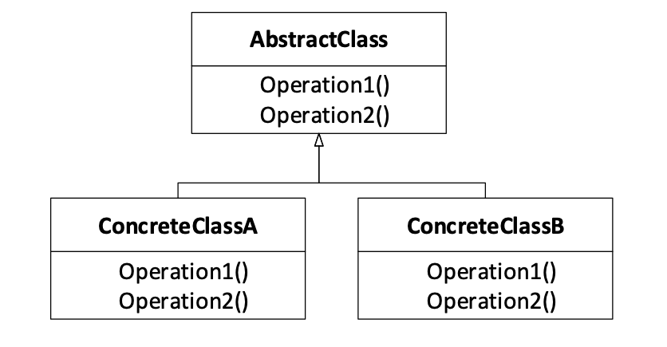

# **设计模式 ： 行为模型**

## **ex) AI模型预测框架**


给定一批数据与AI模型，要求给出模型预测结果
AI模型预测流程通常由数据读入、数据处理、模型预测、结果评测几部分组成

```C++
class AIFramework {
public:
	void readData(string path);
	string processData(OneData data);
	float evaluate(vector<int> results);
	int predict(string input);
	OneData* getAllData();
	AIFramework(Model *model);
	virtual ~AIFramework();
protected: ////用以存储数据和模型的成员变量
	OneData allData[DATA_NUM];
	Model* myModel;
};
//组合一个模型接口来进行结果预测
int AIFramework::predict(string input) {	
	return myModel->predict(input);
}

struct OneData {
	string text;
	int label;
}; 

//主程序
int main(int argc, char *argv[]) {
	Model model;

	AIFramework ai(&model);
	//数据读入
	ai.readData("input.txt");

	vector<int> all_results;
	for (int i = 0; i != DATA_NUM; i++) {
		//数据处理
		string inp = ai.processData(ai.getAllData()[i]);
		//结果预测
		int result = ai.predict(inp);
		all_results.push_back(result);
	}
	//结果评估
	ai.evaluate(all_results);
	return 0; 	
}

//规定所有的任务类型
enum AIFrameworkType 
		{Sentiment, Topic, Spam};
AIFrameworkType type = Sentiment;

…
void AIFramework::readData(string path){

	switch (type) {//读取数据的实现
		//情感分析的数据读取
case Sentiment:
			allData = …;
		//主题分类的数据读取
		case Topic:
	allData = …;
		//垃圾邮件分类的数据读取
		case Spam:
			allData = …;
	}
}

string AIFramework::processData(OneData data){  //处理数据的实现
	switch (type) {
case Sentiment:
			…
		case Topic:
	…
		case Spam:
			…
	}
}
float AIFramework::evaluate(vector<int> results){  //结果评测的实现
	switch (type) {
case Sentiment:
			…
		case Topic:
	…
		case Spam:
			…
	}
}

```

#### **简单枚举存在的问题？当新增一个系统进入后，我们需要对每一个方法进行相应修改，修改的工作量很大。**

## **Template Method**



```C++
class AIFramework {
public:
	virtual void readData(string path) = 0;
	virtual string processData(OneData data) = 0;
	virtual float evaluate(vector<int> results) = 0;
	int predict(string input);
	OneData* getAllData();
	AIFramework(Model *model);
	virtual ~AIFramework();
protected: ////用以存储数据和模型的成员变量
	OneData allData[DATA_NUM];
	Model* myModel;
};
//组合一个模型接口来进行结果预测
int AIFramework::predict(string input) {	
	return myModel->predict(input);
}
```

