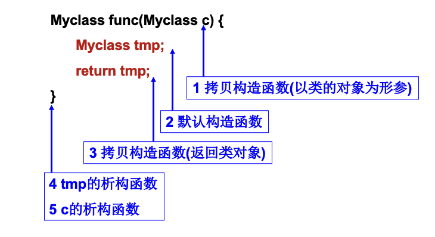

## **拷贝构造函数**
如果我们不想给予函数修改权限，则可以在参数中使用常量/常量引用
```C++
void add(const int& a, const int& b)
```
此时函数中仅能读取a和b的值，无法对a, b进行任何修改操作。

**拷贝构造函数是一种特殊的构造函数，它的参数是语言规定的，是同类对象的常量引用**
```C++
class Person {
    int id;  
    ...
public:
    Person(const Person& src) { id = src.id;  ... }
    ...
};
```
作用：用参数对象的内容初始化当前对象

拷贝构造函数被调用的三种常见情况：

```C++
1、用一个类对象定义另一个新的类对象
	Test a; Test b(a); 
	Test c = a;

2、函数调用时以类的对象为形参
     Func(Test a)

3、函数返回类对象
	Test Func(void)
```

编译器会自动调用“拷贝构造函数”，在已有对象基础上生成新对象。

类的新对象被定义后，会调用构造函数或拷贝构造函数。如果调用拷贝构造函数且当前没有给类**显式定义拷贝构造函数**，编译器将自动合成 **“隐式定义的拷贝构造函数”**，其功能是调用所有数据成员的**拷贝构造函数或拷贝赋值运算符。**

#### !位拷贝原本是C中的概念。在C++中，只有基础类型（int, double等）才会进行位拷贝；对于自定义类，编译器会递归调用所有数据成员的拷贝构造函数或拷贝赋值运算符。但一些教材中仍然把这种行为称为“位拷贝”，以区别用户自定义的拷贝方法。!

### 隐式定义的拷贝构造函数示例
```C++
class Test {
    int data;
    char* buffer;
public:
    Test() { } //默认构造函数
    ~Test() { } //析构函数
};
```

当定义Test类的对象时(Test a; Test b=a;)，使用自动合成的隐式定义的拷贝构造函数
编译器使用位拷贝初始化b的数据成员b.data = a.data, b.buffer = a.buffer

#### !注意：位拷贝在遇到指针类型成员时可能会出错,导致多个指针类型的变量指向同一个地址!

### 拷贝构造函数：执行顺序


example
```c++
#include <iostream>
using namespace std;

class Test {
public:
    Test() { //构造函数
        cout << "Test()" << endl; 
    }
    Test(const Test& src) { //拷贝构造
        cout << "Test(const Test&)" << endl; 
    }
    ~Test() { //析构函数
        cout << "~Test()" << endl;
    }
};
Test copyObj(Test obj) { 
    cout << "func()..." << endl; 
    return Test();
}

int main() {
    cout << "main()..." << endl;
    Test t;
    t = copyObj(t);
    return 0;
}


/* result
main()...
Test()	//main函数内初始化 Test
Test(const Test&)//func参数 拷贝构造
func()...
Test()	 //初始化 Test类的对象
Test(const Test&) //返回时拷贝构造
~Test()
~Test()
~Test()
~Test()
*/
```
注意采用编译选项，禁止编译器进行返回值优化：

g++ test.cpp --std=c++11 -fno-elide-constructors –o test

**当类内含指针类型的成员时，为避免指针被重复删除，不应使用隐式定义的拷贝构造函数**

```C++
#include <iostream>
#include <cstring>
using namespace std;

class Pointer {
    int *m_arr;
    int m_size;
public:
    Pointer(int i):m_size(i) { //构造
        m_arr = new int[m_size];
        memset(m_arr, 0, m_size*sizeof(int));
    }
    ~Pointer(){delete []m_arr;} //析构
    void set(int index, int value) {
        m_arr[index] = value;
    }
    void print();
};

void Pointer::print()
{
    cout << "m_arr: ";
    for (int i = 0; i < m_size; ++ i)
    {
        cout << " " << m_arr[i];
    }
    cout << endl;
}

int main() {
 	Pointer a(5);
 	Pointer b = a; //调用默认的拷贝构造
    a.print();
    b.print();
    b.set(2, 3);
    b.print();
    a.print();
    return 0;
}
```

正常情况下，应尽可能避免使用拷贝构造函数

**解决方法**：

**（1）使用引用/常量引用传参数或返回对象；**
```C++
引用或常量引用传递参数
func(MyClass a) -> func(const MyClass& a)
返回值为引用
MyClass func(…) -> MyClass& func(…)
```
**（2）将拷贝构造函数声明为private；**
```C++
class MyClass{
    MyClass(const MyClass&){} 
    public:   
        MyClass()=default;
        ......
    }
```
**（3）用delete关键字让编译器不生成拷贝构造函数的隐式定义版本。**
```C++
class MyClass
{
    public:
    MyClass()=default;
    MyClass(const MyClass&)=delete;
    ......
}
```

## **拷贝构造函数的调用时机**
用一个类对象/引用/常量引用初始化另一个新的类对象

以类的对象为函数形参，传入实参为类的对象/引用/常量引用

函数返回类对象（类中未显式定义移动构造函数，不进行返回值优化）

已定义的对象之间相互赋值，可通过调用对象的“拷贝赋值运算符函数”来实现的

## **拷贝赋值运算符**
```c++
ClassName& operator= (const ClassName& right) {
   if (this != &right) {// 避免自己赋值给自己
		// 将right对象中的内容拷贝到当前对象中...
	}
   return *this;
}
ClassName a = b;
```
实例
```C++
Test& operator= (const Test& right) {
	if (this == &right)  cout << "same obj!\n";
	else {
		for(int i=0; i<10; i++)
			buf[i] = right.buf[i];  //拷贝数据
	cout << "operator=(const Test&) called.\n";
}
	return *this;
}
```
赋值重载函数必须要是类的非静态成员函数(non-static member function)，不能是友元函数。

为什么不能是友元函数：同类对象之间的赋值已经是成员函数了，没有必要再友元。

友元的话一定不是成员函数


