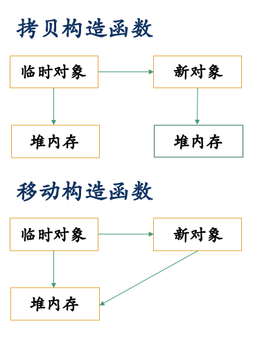

## **移动构造函数**

使用右值引用作为参数的构造函数叫做移动构造函数。

移动构造函数
```c++
ClassName(ClassName&& VariableName);
```
拷贝构造函数
```C
ClassName(const ClassName& VariableName);
```
对于一些即将析构的临时类，移动构造函数直接利用了原来临时对象中的堆内存，新的对象无需开辟内存，临时对象无需释放内存，从而大大提高计算效率。



移动构造函数：实例

```C++
class Test {
public:
	int * buf; //// only for demo.
	Test() {
		buf = new int[10]; //申请一块内存
		cout << "Test(): this->buf @ " << hex << buf << endl;
	}
	~Test() {
		cout << "~Test(): this->buf @ " << hex << buf << endl;
		if (buf) delete[] buf;
	}
	Test(const Test& t) : buf(new int[10]) {
		for(int i=0; i<10; i++) 
			buf[i] = t.buf[i]; //拷贝数据
		cout << "Test(const Test&) called. this->buf @ "
			<< hex << buf << endl;
	}
	Test(Test&& t) : buf(t.buf) { //直接复制地址，避免拷贝
		cout << "Test(Test&&) called. this->buf @ "
			<< hex << buf << endl;
		t.buf = nullptr; //将t.buf改为nullptr，使其不再指向原来内存区域
	}
};

Test GetTemp() {
	Test tmp;
	cout << "GetTemp(): tmp.buf @ "
		<< hex << tmp.buf << endl;
	return tmp;
}****
void fun(Test t) {
	cout << "fun(Test t): t.buf @ "
		<< hex << t.buf << endl;
}

int main() {
	Test a = GetTemp();
	cout << "main() : a.buf @ " << hex << a.buf << endl;
	fun(a);
	return 0;
}
// Test(): this->buf @ 0x600000c04000
// GetTemp(): tmp.buf @ 0x600000c04000
// main() : a.buf @ 0x600000c04000
// Test(const Test&) called. this->buf @ 0x600000c04030
// fun(Test t): t.buf @ 0x600000c04030
// ~Test(): this->buf @ 0x600000c04030
// ~Test(): this->buf @ 0x600000c04000 
```

## **右值引用：移动语义**

移动构造函数加快了右值初始化的构造速度。

如何对左值调用移动构造函数以加快左值初始化的构造速度?

### **std::move函数**
输入：左值（包括变量等，该左值一般不再使用）

返回值：该左值对应的右值
```C++
Test a;
Test b = std::move(a) //对于上个实例中定义的Test类，该处
							 调用移动构造函数对b进行初始化
```
!注意：move函数本身不对对象做任何操作，仅做类型转换，即转换为右值。移动的具体操作在移动构造函数内实现。!

详细阅读：https://blog.csdn.net/swartz_lubel/article/details/59620868

实例：
```C++
template <class T>
swap(T& a, T& b) { 
     T tmp(a); //copy a to tmp 
     a = b; //copy b to a 
     b = tmp; //copy tmp to b 
}

template <class T>
swap(T& a, T& b) { 
     T tmp(std::move(a));
     a = std::move(b);
     b = std::move(tmp);
}
```

## **判断依据：引用的绑定规则**

拷贝构造函数的形参类型为常量左值引用，可以绑定常量左值、左值和右值

移动构造函数的形参类型为右值引用，可以绑定右值

引用的绑定存在优先级，例如常量左值引用和右值引用均能绑定右值，当传入实参类型为右值时优先匹配形参类型为右值引用的函数


## **移动构造函数的常见调用时机**

用一个类对象的右值初始化另一个新的类对象（常配合std::move函数一起使用）: Test b = func(a); Test b = std::move(a); 与Test b = a; 不同

以类的对象为函数形参，传入实参为类对象的右值（常配合std::move函数一起使用）: func(Test());func(std::move(a));与func(a)不同

函数返回类对象（类中显式定义移动构造函数，不进行返回值优化）: {return Test(); or return tmp;}均调用移动构造
## **移动赋值运算符**
```C++
Test& operator= (Test&& right) {
	if (this == &right)  cout << "same obj!\n";
	else {	
		this->buf = right.buf;  //直接赋值地址
		right.buf = nullptr;
	cout << "operator=(Test&&) called.\n";
}
	return *this;
}

swap(Test& a, Test& b) { 
     Test tmp(std::move(a)); // 第一行调用移动构造函数
     a = std::move(b);       // std::move的结果为右值引用，
     b = std::move(tmp); // 后两行均调用移动赋值运算
}
```


