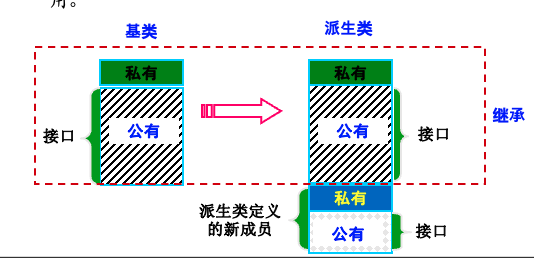
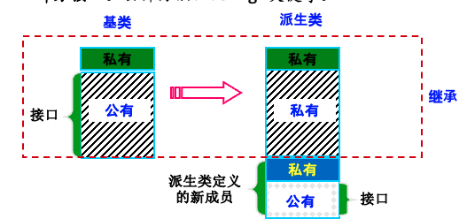

# **继承**
被继承的已有类，被称为基类(base class)，也称“**父类**”。

通过继承得到的新类，被为**派生类**(derived class），也称“**子类**”、“**扩展类**”。

**常见的继承方式：public, private**

class Derived : [private] Base { .. }; 缺省继承方式为private继承。

class Derived : public Base { ... };

**protected 继承很少被使用**

class Derived : protected Base { ... };

什么不能被继承？

构造函数：创建派生类对象时，必须调用派生类的构造函数，派生类构造函数调用基类的构造函数，以创建派生对象的基类部分。C++11新增了继承构造函数的机制（使用using），但默认不继承
析构函数：释放对象时，先调用派生类析构函数，再调用基类析构函数
赋值运算符：
编译器不会继承基类的赋值运算符（参数为基类）
但会自动合成隐式定义的赋值运算符（参数为派生类），其功能为调用基类的赋值运算符。
友元函数：不是类成员

```C++
#include <iostream>
using namespace std;

class Base{
public:
	int k = 0;
	void f(){cout << "Base::f()" << endl;}
	Base & operator= (const Base &right){
		if(this != &right){
			k = right.k;
			cout << "operator= (const Base &right)" << endl;
		}
		return *this;
	}
};
class Derive: public Base{};
int main(){
	Derive d, d2;
	cout << d.k << endl; //Base数据成员被继承
	d.f(); //Base::f()被继承
	
	Base e;
	//d = e; //编译错误，Base的赋值运算符不被继承
	d = d2;  //调用隐式定义的赋值运算符
	return 0;
}
```

## **派生类对象的构造与析构过程**
**基类中的数据成员，通过继承成为派生类对象的一部分，需要在构造派生类对象的过程中调用基类构造函数来正确初始化。**

若没有显式调用，则编译器会自动调用基类的默认构造函数。

### **调用基类构造函数**
```C++
class Base 
{
    int data;
public:
    Base() : data(0) { cout << "Base::Base(" << data << ")\n"; }
			/// 默认构造函数
    Base(int i) : data(i) { cout << "Base::Base(" << data << ")\n"; }
};
class Derive : public Base {
public:
    Derive() { cout << "Derive::Derive()" << endl; }     /// 无显式调用基类构造函数，则调用基类默认构造函数
};
int main() {
    Derive obj;	
	return 0;
} // g++ 1.cpp –o 1.out -std=c++11
```

若想要显式调用，则只能在派生类构造函数的初始化成员列表中进行，既可以调用基类中不带参数的默认构造函数，也可以调用合适的带参数的其他构造函数。
```C++
class Base 
{
    int data;
public:
    Base() : data(0) { cout << "Base::Base(" << data << ")\n"; }
			/// 默认构造函数
    Base(int i) : data(i) { cout << "Base::Base(" << data << ")\n"; }
};
class Derive : public Base {
public:
    Derive(int i) : Base(i) { cout << “Derive::Derive()” << endl; } 
    /// 显式调用基类构造函数
};
int main() {
    Derive obj(356);	
	return 0;
} // g++ 1.cpp –o 1.out -std=c++11
```

**先执行基类的构造函数来初始化继承来的数据，再执行派生类的构造函数。**

**对象析构时，先执行派生类析构函数，再执行由编译器自动调用的基类的析构函数。**

### **在派生类中使用 using Base::Base; 来继承基类构造函数，相当于给派生类“定义”了相应参数的构造函数，如**
```C++
class Base 
{
    int data;
public:
    Base(int i) : data(i) { cout << "Base::Base(" << i << ")\n"; }
};
class Derive : public Base {
public:
    using Base::Base; 		///相当于 Derive(int i):Base(i){};
};
int main() {
    Derive obj(356);
	
    return 0;
} // g++ 1.cpp –o 1.out -std=c++11
```

### **当基类存在多个构造函数时，使用using会给派生类自动构造多个相应的构造函数。**

```C++
class Base 
{
    int data;
public:
    Base(int i) : data(i) { cout << "Base::Base(" << i << ")\n"; }
	Base(int i, int j) 
		{ cout << "Base::Base(" << i << “," << j << ")\n";}
};
class Derive : public Base {
public:
    using Base::Base; 		///相当于 Derive(int i):Base(i){};
                     ///加上 Derive(int i, int j):Base(i，j){};
};
int main() {
    Derive obj1(356);
	Derive obj2(356, 789);
    return 0;
} // g++ 1.cpp –o 1.out -std=c++11
```
！如果基类的某个构造函数被声明为私有成员函数，则不能在派生类中声明继承该构造函数。！
！如果派生类使用了继承构造函数，编译器就不会再为派生类生成隐式定义的默认构造函数。！


## **如何选择继承方式？**
### **public继承**
基类中公有成员仍能在派生类中保持公有。原接口可沿用。最常用。


### **private继承**
is-implementing-in-terms-of(照此实现)：用基类接口实现派生类功能。移除了 is-a 关系。



### **成员访问权限**

**基类中的私有成员** ： 不允许在派生类成员函数中访问，也不允许派生类的对象访问它们。

**基类中的公有成员** ： 
允许在派生类成员函数中被访问

若是使用public继承方式，则成为派生类公有成员，可以被派生类的对象访问；

若是使用private/protected继承方式，则成为派生类私有/保护成员，不能被派生类的对象访问。若想让某成员能被派生类的对象访问，可在派生类public部分用关键字using声明它的名字。

**基类中的保护成员** ： 保护成员允许在派生类成员函数中被访问，但不能被外部函数访问。

**公有继承、基类公有成员的访问**
```C++
#include <iostream>
using namespace std;

class Base {
public: 
  void baseFunc() { cout << "in Base::baseFunc()..." << endl; }
};

class Derive1: public Base {}; // D1类的继承方式是public继承

int main() {
  Derive1 obj1; 
  cout << "calling obj1.baseFunc()..." << endl;
  obj1.baseFunc(); // 基类接口成为派生类接口的一部分，派生类对象可调用

  return 0;
}
```
**私有继承、基类公有成员的访问**
```C++
#include <iostream>
using namespace std;
class Base {
public: 
  void baseFunc() { cout << "in Base::baseFunc()..." << endl; }
};

class Derive2: private Base 
{/// 私有继承， is-implementing-in-terms-of：用基类接口实现派生类功能
public:
  void deriveFunc() {
    cout << “in Derive2::deriveFunc(),                   calling Base::baseFunc()..." << endl;
    baseFunc(); /// 私有继承时，基类接口在派生类成员函数中可以使用
  }
};

int main() {
  Derive2 obj2; 
  cout << "calling obj2.deriveFunc()..." << endl;
  obj2.deriveFunc(); 
  //obj2.baseFunc(); ERROR: 基类接口不允许从派生类对象调用
 
  return 0;
}
```
**私有继承，打开基类公有成员的访问权限**
```C++
#include <iostream>
using namespace std;
class Base {
public: 
  void baseFunc() { cout << "in Base::baseFunc()..." << endl; }
};

class Derive3: private Base {// B的私有继承
public:
  /// 私有继承时，在派生类public部分声明基类成员名字
  using Base::baseFunc; 
};

int main() {
  Derive3 obj3;
  cout << "calling obj3.baseFunc()..." << endl;
  obj3.baseFunc(); //基类接口在派生类public部分声明，则派生类对象可调用

  return 0;
}
```
**私有继承中，基类中的私有、保护成员访问**
```C++
#include <iostream>
using namespace std;

class Base{
private:
  int a{0};
protected:
  int b{0};
};

class Derive : private Base{
public:
  void getA(){cout<<a<<endl;} ///编译错误，不可访问基类中私有成员
  void getB(){cout<<b<<endl;} ///可以访问基类中保护成员
};

int main() 
{
  Derive d;
  d.getB();
  //cout<<d.b; ///编译错误，派生类对象不可访问基类中保护成员
  return 0;

```
**私有继承中，基类中的私有、保护成员访问**
```C++

#include <iostream>using namespace std;
class Base {private:    int data{0};public:    int getData(){ return data;}
    void setData(int i){ data=i;}};
class Derive1 : private Base {public:    using Base::getData;};
int main() {    Derive1 d1;    cout<<d1.getData();    //d1.setData(10);   ///隐藏了基类的setData函数，不可访问    //Base& b = d1;        ///不允许私有继承的向上转换    //b.setData(10);    ///否则可以绕过D1，调用基类的setData函数
	return 0；}
```
### **基类成员访问权限与三种继承方式**

**public继承**

基类的公有成员，保护成员，私有成员作为派生类的成员时，都保持原有的状态。

**private继承**

基类的公有成员，保护成员，私有成员作为派生类的成员时，都作为私有成员。

**protected继承**

基类的公有成员，保护成员作为派生类的成员时，都成为保护成员，基类的私有成员仍然是私有的。

### **继承示例 is-a**

```C++
#include <iostream>
using namespace std;

class Pet{
public:
  void eat(){cout<<"Pet eat"<<endl;}
  void sleep(){cout<<"Pet sleep"<<endl; }
};

class Duck : public Pet{
public:
  void eat(){cout<<"Duck eat"<<endl;}
};

int main() 
{
  Duck duck;
  duck.eat();
  duck.sleep();
  return 0;
}

```
